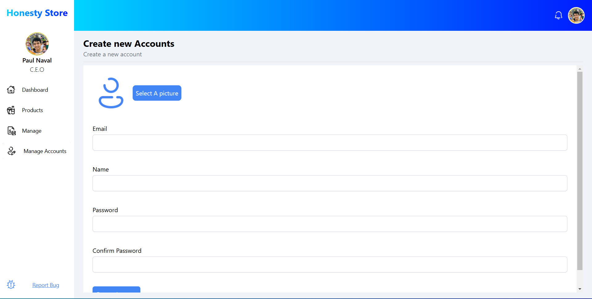

# Macchu Pichu

**Target:** TBD

---

<table>
  <tr>
    <td valign="top" style="width: 35%;">
      <h2>Site Map</h2>
      <a href="../readme.md">Revisions</a>       
      Admin Homepage 
      &nbsp;&nbsp;<a href="./sign-in.md">Sign in</a>  
      Products Page 
      &nbsp;&nbsp;<a href="./add-product.md">Add product</a> 
      &nbsp;&nbsp;<a href="./edit-product.md">Edit product</a> 
      &nbsp;&nbsp;<a href="./delete-product.md">Delete product</a> 
      &nbsp;&nbsp;<a href="./add-inventory.md">Add inventory</a> 
      &nbsp;&nbsp;<a href="./browse-inventories.md">Browse inventories</a> 
      &nbsp;&nbsp;<a href="./edit-inventory.md">Edit inventory</a> 
      &nbsp;&nbsp;<a href="./delete-inventory.md">Delete inventory</a> 
      &nbsp;&nbsp;<a href="./add-category.md">Add category</a> 
      &nbsp;&nbsp;<a href="./edit-category.md">Edit category</a> 
      &nbsp;&nbsp;<a href="./delete-category.md">Delete category</a> 
      &nbsp;&nbsp;<a href="./add-supplier.md">Add supplier</a> 
      &nbsp;&nbsp;<a href="./edit-suppplier.md">Edit supplier</a> 
      &nbsp;&nbsp;<a href="./delete-supplier.md">Delete supplier</a> 
      &nbsp;&nbsp;<a href="./create-inventory-report.md">Create Inventory Report</a>  
      Finance Page 
      &nbsp;&nbsp;<a href="./create-report.md">Create Report</a> 
      &nbsp;&nbsp;<a href="./create-audit.md">Create Audit</a>  
      Manage Accounts Page 
      &nbsp;&nbsp;<a href="./create-admin-account.md">Create Admin Account</a>  
    </td>
    <td valign="top" >
      <h6> Accounts Page > Create Admin Account </h6>
        
      <h3>Create Admin Account</h3>
      
This serves as the means to create new admin accounts. <strong>Only accessible by CEO-level privilege</strong>

      <table border="1">
        <tr>
          <th>Use Case</th>
          <th>Create Admin Account</th>
        </tr>
        <tr>
          <td><b>Actors</b></td>
          <td>User (Primary), System (Secondary)</td>
        </tr>
        <tr>
          <td><b>Preconditions</b></td>
          <td><ul><li>Current logged-in user must have CEO-level privilege</li></ul></td>
        </tr>
        <tr>
          <td>Triggers</td>
          <td>User clicks the 'Create Account' button</td>
        </tr>
        <tr>
          <td><b>Basic Flow</b></td>
          <td>
            <ol>
              <li><strong>(optional)</strong> User selects a picture for the account</li>
              <li>User enters the email, name, and password of the account to be created</li>
              <li>System validates credentials</li>
              <li>If valid, system creates the account and stores into account database</li>
            </ol>
          </td>
        </tr>
        <tr>
          <td><b>Alternative Flow</b></td>
          <td><strong>Invalid Credentials</strong>: System shows an error message 
          <strong>Email already used</strong>: System shows email already used error message 
          <strong>Account created without selecting an image</strong>: Account is still created but with default image as profile picture</strong>
          </td>
        </tr>
        <tr>
          <td><b>Postconditions</b></td>
          <td>A new admin account is created and ready to use</td>
        </tr>
        <tr>
          <td><b>Exceptions</b></td>
          <td>Server is down → System shows error message</td>
        </tr>
        </table>
        <table>
        <tr>
          <th>Use Case</th>
          <th>Upload profile picture during admin account creation</th>
        </tr>
        <tr>
          <td><b>Actors</b></td>
          <td>User (primary), System (secondary)</td>
        </tr>
        <tr>
          <td><b>Preconditions</b></td>
          <td>
            <ul>
              <li>User has CEO-level privilege</li>
              <li>User is on the Manage Accounts page</li>
              <li>User has access to an image file on their device</li>
            </ul>
          </td>
        </tr>
        <tr>
          <td>Triggers</td>
          <td>User clicks the 'Select a picture' button</td>
        </tr>
        <tr>
          <td><b>Basic Flow</b></td>
          <td>
            <ol>
              <li>User clicks on 'Select a picture' button</li>
              <li>User selects an image from the system file selection dialog</li>
              <li>System displays the image in admin account creation form</li>
            </ol>
          </td>
        </tr>
        <tr>
          <td><b>Alternative Flow</b></td>
          <td><strong>Image selection aborted</strong>: No image is selected, no changes will be observed 
          </td>
        </tr>
        <tr>
          <td><b>Postconditions</b></td>
          <td>Image is now displayed on admin account creation form</td>
        </tr>
        <tr>
          <td><b>Exceptions</b></td>
          <td>Selected file is not an image → System shows error message</td>
        </tr>
        </table>
    </td>
  </tr>
</table>

---

  © 2025 <a href="#">NexTech</a>

