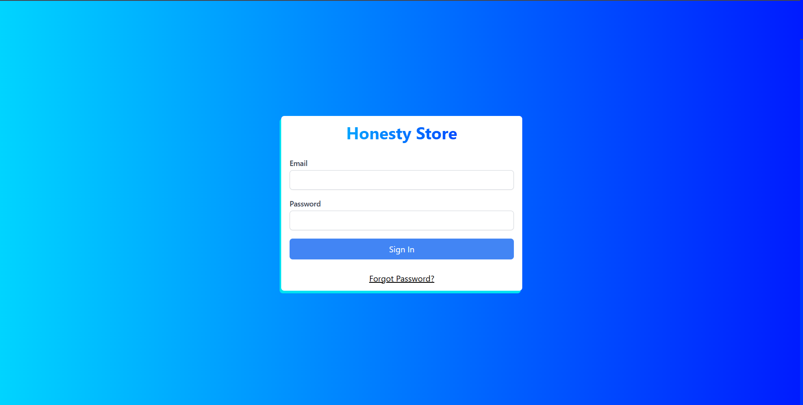

# Macchu Pichu

**Target:** TBD

---

<table>
  <tr>
    <td valign="top" style="width: 35%;">
      <h2>Site Map</h2>
      <a href="../readme.md">Revisions</a>       
      Admin Homepage 
      &nbsp;&nbsp;<a href="./sign-in.md">Sign in</a> 
      Products Page 
      &nbsp;&nbsp;<a href="./add-product.md">Add product</a> 
      &nbsp;&nbsp;<a href="./edit-product.md">Edit product</a> 
      &nbsp;&nbsp;<a href="./delete-product.md">Delete product</a> 
      &nbsp;&nbsp;<a href="./add-inventory.md">Add inventory</a> 
      &nbsp;&nbsp;<a href="./browse-inventory.md">Browse inventories</a> 
      &nbsp;&nbsp;<a href="./edit-inventory.md">Edit inventory</a> 
      &nbsp;&nbsp;<a href="./delete-inventory.md">Delete inventory</a> 
      &nbsp;&nbsp;<a href="./add-category.md">Add category</a> 
      &nbsp;&nbsp;<a href="./edit-category.md">Edit category</a> 
      &nbsp;&nbsp;<a href="./delete-category.md">Delete category</a> 
      &nbsp;&nbsp;<a href="./add-supplier.md">Add supplier</a> 
      &nbsp;&nbsp;<a href="./edit-suppplier.md">Edit supplier</a> 
      &nbsp;&nbsp;<a href="./delete-supplier.md">Delete supplier</a> 
      &nbsp;&nbsp;<a href="./create-inventory-report.md">Create Inventory Report</a>  
      Finance Page 
      &nbsp;&nbsp;<a href="./create-report.md">Create Report</a> 
      &nbsp;&nbsp;<a href="./create-audit.md">Create Audit</a>  
      Manage Accounts Page 
      &nbsp;&nbsp;<a href="./create-admin-account.md">Create Admin Account</a>  
    </td>
    <td valign="top" >
      <h6> Admin Homepage > Sign in </h6>
        
      <h3>Sign in</h3>
      
This serves as the main authentication page for admins to access the Honesty Store.

      <table border="1">
        <tr>
          <th>Use Case</th>
          <th>Sign in</th>
        </tr>
        <tr>
          <td><b>Actors</b></td>
          <td>User (Primary), System (Secondary)</td>
        </tr>
        <tr>
          <td><b>Preconditions</b></td>
          <td>User must have an existing account</td>
        </tr>
        <tr>
          <td>Triggers</td>
          <td>User clicks the 'Sign In' button.</td>
        </tr>
        <tr>
          <td><b>Basic Flow</b></td>
          <td>
            <ol>
              <li>User enters email & password.</li>
              <li>User clicks 'Sign-in'</li>
              <li>System validates credentials</li>
              <li>If valid, system redirects to the admin dashboard</li>
            </ol>
          </td>
        </tr>
        <tr>
          <td><b>Alternative Flow</b></td>
          <td><strong>Invalid Credentials</strong>: System shows an error message</td>
        </tr>
        <tr>
          <td><b>Postconditions</b></td>
          <td>User is logged in and can access their account.</td>
        </tr>
        <tr>
          <td><b>Exceptions</b></td>
          <td>Server is down → System shows error message</td>
        </tr>
        </table>
    </td>
  </tr>
</table>

---

  © 2025 <a href="#">NexTech</a>

